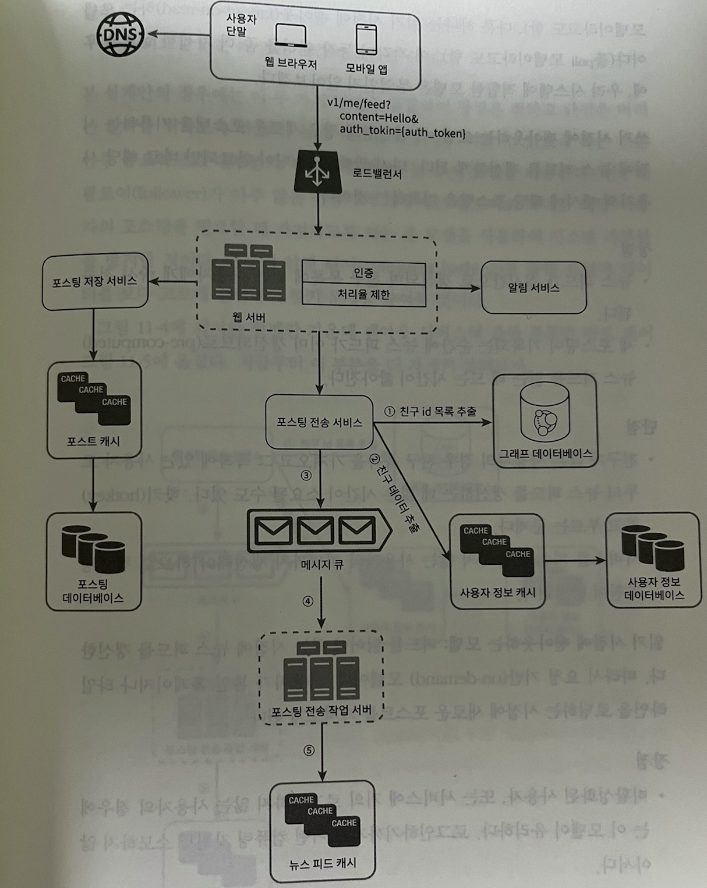
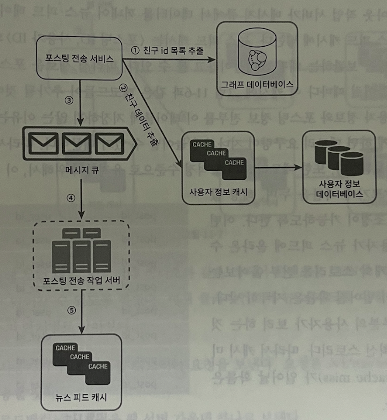
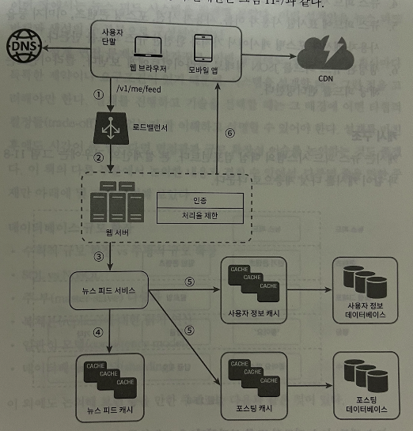

# 뉴스 피드 시스템 설계

## 1단계. 문제 이해 및 설계범위 확정

- 뉴스 피드 페이지에 새로운 스토리를 올릴 수 있어야하고, 친구들이 올리는 스토리도 볼 수 있어야 한다
- 순서는 시간 역순
- 한 명의 사용자는 최대 5천명의 친구를 갖는다
- 트래픽은 매일 천만명의 방문
- 피드엔 이미지 비디오 등의 미디어 파일이 포함됨

## 2단계. 개략적 설계안 제시 및 동의 구하기

- 피드 발행
  - 사용자가 스토리를 포스팅하면 해당 데이터를 캐시와 데이터베이스에 기록
  - 새 포스팅은 친구의 뉴스 피드에 전송된다.
- 뉴스 피드 생성
  - 지면 관계상 뉴스 피드는 모든 친구의 포스팅을 시간 역순으로 모아서 만든다

### 피드 발행

피드 발행 시 해야할 일은, 

- 로드밸런서는 적절히 트래픽을 웹 서버로 분산
- 웹 서버는 내부 서비스로 중계하는 역할
- 포스팅 저장 / 전송 / 알림 크게 3가지를 해야 한다.
- 포스팅 저장 시엔, 포스팅을 캐시와 DB 에 저장
- 포스팅 전송 서비스 : 새 포스팅을 친구의 뉴스 피드에 푸시한다. 이 또한 캐시에 보관하여 빠르게 읽어갈 수 있도록 한다. 

### 뉴스 피드 생성

뉴스 피드 서비스에선 캐시에서 뉴스 피드를 가져온다. 

뉴스 피드 캐시에는 필요한 피드 ID 를 보관하고 있다. 

## 3단계. 상세 설계

포스팅 전송 서비스(팬아웃, `Fanout`)는 포스팅을 사용자와 친구 관계에 있는 **모든 사용자에게 전달**하는 과정

이 시점을 2가지로 쓰기 시점에 팬아웃 하거나, 읽는 시점에 팬아웃 할 수 있다.

#### 쓰기 시점에 팬아웃하는 모델 (푸시 모델)

새로운 포스팅을 기록하는 시점에 뉴스 피드를 갱신

장점

- 뉴스피드가 실시간 갱신, 친구에게 실시간 전송
- 새 포스팅이 기록되는 순간에 뉴스피드가 갱신되므로 뉴스 피드 읽는데 드는 시간이 짧아진다.

단점

- 친구 목록을 가져오고, 모든 친구의 뉴스 피드를 갱신하는데 많은 시간 소요될 수 있다. (핫키 문제)
- 서비스를 자주 이용하지 않는 사용자의 피드까지 갱신해야하므로 컴퓨팅 자원 낭비

#### 읽기 시점에 팬아웃 하는 모델 (풀 모델)

피드를 읽어야하는 시점에 뉴스 피드를 갱신하는 요청 기반 모델

장점

- 비활성화된 사용자의 경우 컴퓨팅 자원 낭비가 없다
- 데이터를 친구 각각에게 푸시하는 작업이 필요 없으므로 핫키 문제도 생기지 않는다

단점

- 뉴스 피드를 읽는 데 많은 시간이 소요될 수 있다

2가지 방법을 결합해서 사용해보자!

- **뉴스 피드를 빠르게 가져오기 위해서 대부분의 사용자에 대해 푸시 모델**을 사용
- **친구나 팔로어가 많은 사용자의 경우 팔로어가 해당 사용자의 포스팅을 필요할 때 가져가도록 하는 풀 모델**을 사용하여 과부하 방지
- 안정 해시를 통해 요청과 데이터를 보다 고르게 분산하여 핫키 문제를 줄인다

결과적으로 팬아웃 서비스의 동작은 다음과 같다.

1. 그래프 데이터베이스에서 친구 ID 목록을 가져온다. 그래프 데이터베이스는 친구 관계나 친구 추천을 관리하기에 적합
2. 사용자 정보 캐시에서 친구들의 정보를 가져온다. 사용자 설정 가운데 친구를 필터링한다.
3. 친구 목록과 새 스토리의 포스팅 ID를 메시지 큐에 넣는다.
4. 팬아웃 작업 서버가 메시지 큐에서 데이터를 꺼내어 뉴스 피드 데이터를 뉴스 피드 캐시에 넣는다. 
   - 뉴스 피드 캐시는 <포스팅 ID, 사용자 ID> 순서쌍을 보관하는 매핑 테이블에 가깝다.
   - id 만 보관하여 크기를 적정수준으로 유지한다. 

#### 피드 읽기 흐름 상세 설계

1. 사용자가 뉴스 피드를 읽으려는 요청을 보낸다.
2. 로드밸런서가 웹 서버 중 하나로 보낸다. 
3. 웹 서버는 피드를 가져오기 위해 뉴스 피드 서비스를 호출
4. 뉴스 피드 서비스는 뉴스 피드 캐시에서 포스팅 ID 목록을 가져온다. 
5. 뉴스 피드에 표시할 사용자 정보, 포스트 정보를 사용자 캐시와 포스팅 캐시에서 가져와 완전한 피드로 만든다.
6. 생성된 뉴스피드를 응답한다.

**캐시 구조**

캐시는 뉴스 피드 시스템의 핵심 컴포넌트이다. 

- 뉴스 피드 : 뉴스 피드의 ID를 보관
- 컨텐츠 : 포스팅 데이터를 보관하며, 인기 컨텐츠는 일반 컨텐츠와 분리하여 따로 보관한다.
- 행동 : 포스팅에 대한 사용자의 행위에 관한 정보를 보관한다. 포스팅에 대한 좋아요, 답글 등이 해당
- 횟수 : 좋아요 횟수, 응답 수, 팔로어 수 등 의 정보를 보관

