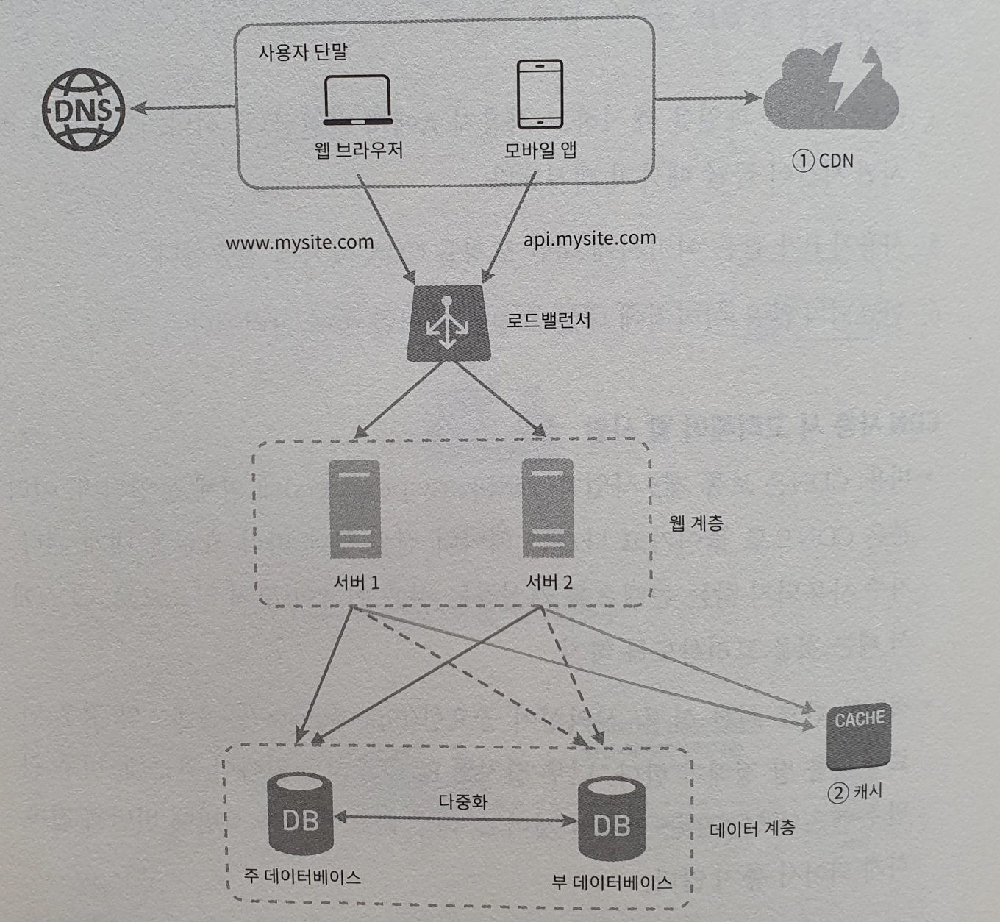
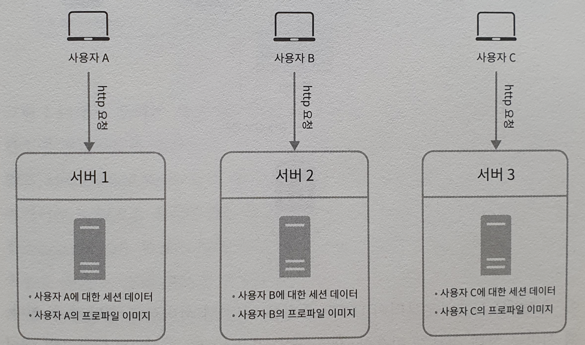
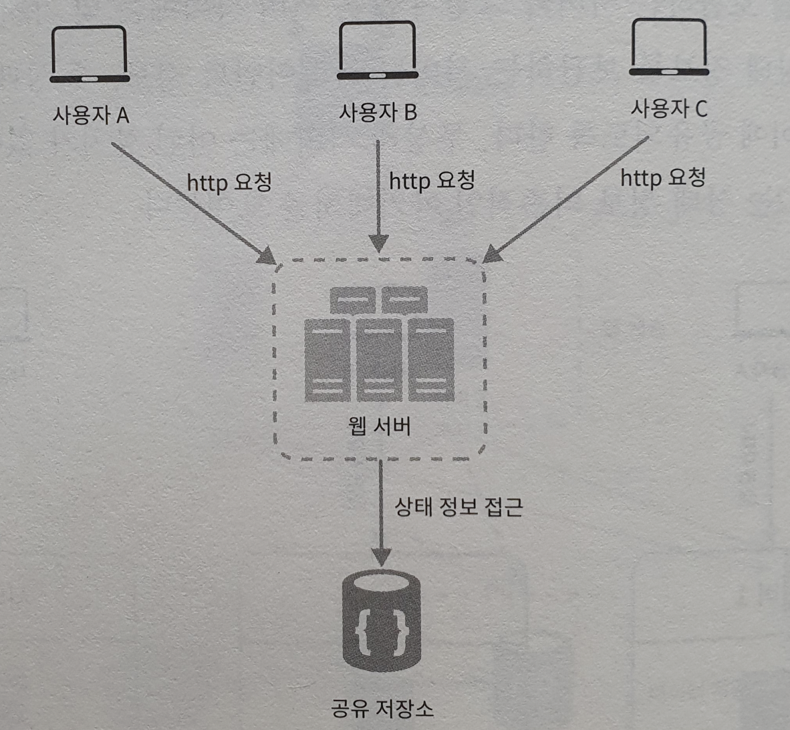
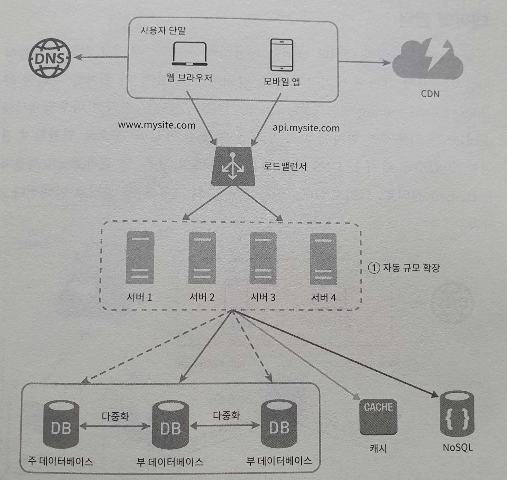
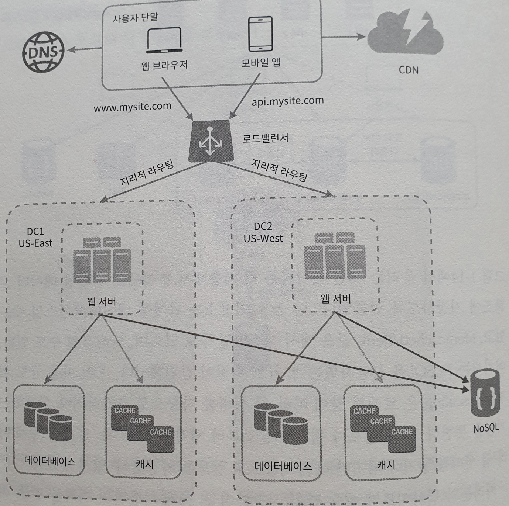
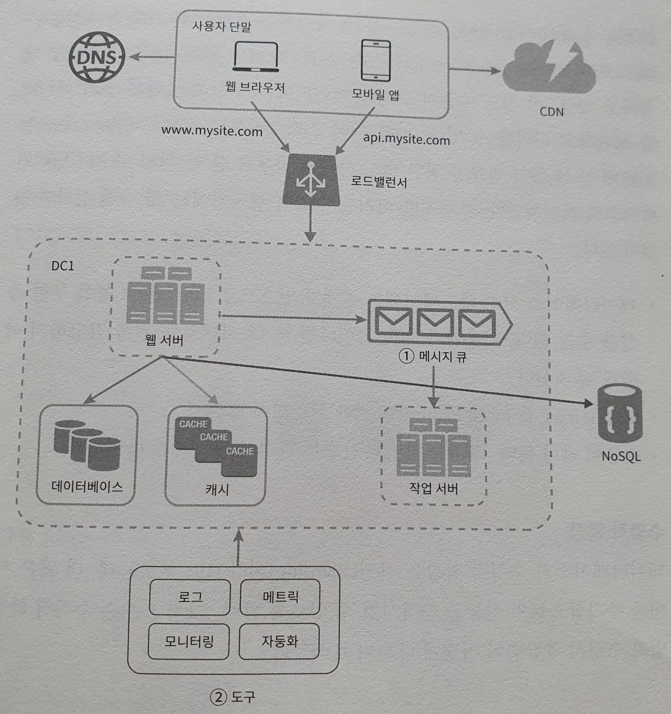

# 사용자 수에 따른 규모 확장성

## 단일 서버

모든 컴포넌트가 단 한 대의 서버에서 실행되는 간단한 시스템부터 설계해보자!

웹, 앱, DB, 캐시 등이 전부 서버 한 대에서 실행된다.

사용자 요청 처리 흐름의 과정을 보자!

1. 사용자는 도메인 이름을 이용하여 웹사이트에 접속한다. 
   이 접속을 위해선 DNS 에 질의하여 IP 주소로 변환하는 과정이 필요하다. 
   (DNS 는 보통 제 3 사업자가 제공하는 유료 서비스를 이용하게 되므로 우리 시스템의 일부는 아님)
2. DNS 조회 결과로 IP 주소가 반환된다. (ex. 15.125.23.214)
3. 해당 IP 주소로 HTTP 요청이 전달된다.
4. 요청을 받은 웹서버는 HTML 이나 JSON 응답을 반환한다.

## 데이터베이스

사용자가 늘면 여러 개의 서버가 필요하다!

- 웹/모바일 트래픽 처리용
- 데이터베이스용

각각 분리해두면 독립적으로 확장 가능!

### 어떤 데이터베이스를 사용할 것인가?

- 관계형 데이터베이스
- 비관계형 데이터베이스
  - NoSQL
    - 키-값 저장소
    - 그래프
    - 컬럼
    - 문서
  - 일반적으로 조인 연산은 지원하지 않는다.

- NoSQL 이 바람직한 경우

  - 아주 낮은 응답 지연 시간을 요구할 때

  - 다루는 데이터가 비정형이라 관계형 데이터가 아닐 때

  - 데이터를 직렬화하거나, 역직렬화할 수 있기만 하면 될 때

  - 아주 많은 양의 데이터를 저장할 필요가 있을 때

## 수직적 규모 확장 vs 수평적 규모 확장

- 스케일 업
  - 수직적 규모 확장
  - 고사양 자원을 추가하는 행위
  - **단점**
    - 한 대의 서버에 CPU 나 메모리 무한정 증설 불가
    - 장애에 대한 자동복구 방안이나 다중화 방안을 제시하지 않아 장애 발생시 완전히 중단
- 스케일 아웃
  - 더 많은 서버를 추가하여 성능을 개선

만일 너무 많은 사용자가 접속하여 한계 상황에 도달하게 될 경우 응답 속도가 느려지거나 서버 접속이 불가! 
**이를 해결하기 위해선 로드밸런서를 도입해야한다!**

### 로드밸런서

: 부하 분산 집합에 속한 웹 서버들에게 트래픽 부하를 고르게 분산하는 역할

사용자는 공개 IP 주소로 접속하며, 웹서버는 클라이언트의 접속을 직접 처리하지 않는다. 
더 나은 보안을 위해 서버 간 통신에는 사설 IP 주소가 이용된다. 
사설 IP 주소는 같은 네트워크에 속한 서버 사이의 통신에만 쓰일 수 있는 IP 주소로, 인터넷을 통해서는 접속할 수 없다. 
**로드밸런서는 웹 서버와 통신하기 위해 바로 이 사설 주소를 이용한다.** 

이를 통해서 장애를 자동복구하지 못하는 문제를 해소하며, 웹 계층의 가용성은 향상된다. 

**해소 방법**

- 서버 1이 다운되면 모든 트래픽은 서버 2로 전송된다. 
  따라서 웹 사이트 전체가 다운되는 일을 방지할 수 있으며, 부하를 나누기 위해 새로운 서버를 추가할 수 있다
- 웹 사이트로 유입되는 트래픽이 가파르게 증가하면 웹 서버 계층에 더 많은 서버를 추가하여 트래픽을 분산하면 된다.

### 로드밸런서의 종류 

로드 밸런서는 OSI 7 계층을 기준으로 부하를 분산시킨다. 
책의 예시에선 IP 주소를 기반으로 부하를 분산 시킴!

| 2    | Data link 계층을 사용, Mac주소 기반 부하 분산     |                |
| ---- | ------------------------------------------------- | -------------- |
| 3    | Network 계층을 사용, IP주소 기반 부하 분산        |                |
| 4    | Transport 계층을 사용, Port 기반 부하 분산        | TCP, UDP       |
| 7    | Application 계층을 사용, 요청(URL) 기반 부하 분산 | HTTP, HTTPS 등 |

### 로드 밸런서가 서버를 선택하는 방법

- **Round Robin**
  - 요청이 들어오는 대로 서버마다 균등하게 요청을 분배합니다. 가장 단순한 분배 방식입니다.

- **Weighted Round Robin Scheduling**
  - Round Robin방식으로 분배하지만 서버의 가중치에 따라 요청을 더 분배하기도, 덜 분배하기도 합니다. 서버 가중치는 사용자가 지정할 수 있고 동적으로 조정되기도 합니다.
- **Least Connection**
  - 서버마다 연결된 커넥션이 몇개인지 체크하여 커넥션이 가장 적은 서버로 요청을 분배하는 방식입니다.
- **Weighted Least Connections**
  - Least Connection방식으로 분배하지만 서버 가중치에 따라 요청을 더 분배하기도, 덜 분배하기도 합니다. 서버 가중치는 사용자가 지정할 수 있고 동적으로 조정되기도 합니다. 서버 풀에 존재하는 서버들의 사양이 일관적이지 않고 다양한 경우 이 방법이 효과적입니다.

- **Fastest Response Time**
  - 서버가 요청에 대해 응답하는 시간을 체크하여 가장 빠른 서버로 요청을 분배하는 방식입니다.
- **Source Hash Scheduling**
  - 사용자의 IP를 해싱한 후 그 결과에 따라 서버로 요청을 분배합니다. 사용자의 IP는 고정되어 있기 때문에 항상 같은 서버로 연결된다는 보장을 받을 수 있습니다.

출처 : https://deveric.tistory.com/91

## 데이터베이스 다중화

많은 데이터베이스 관리 시스템이 다중화를 지원한다. 
서버 사이에 master-slave 관계를 설정하고 데이터 원본은 master, 사본은 slave 에 저장하는 방식!

- 쓰기 연산은 마스터에서만 지원

- 슬레이브는 마스터로부터 사본을 전달받으며 읽기 연산만 지원한다. 

  - insert, delete, update 등은 master로 전달되어야만 한다.

- 쓰기보다 읽기 연산이 훨씬 많으므로 slave 수가 master 보다 많다!

  

**다중화 장점**

- 성능 개선
  - 모든 변경 연산은 마스터로 전달, 읽기 연산은 슬레이브로 가서 병렬로 처리될 수 있는 쿼리 수가 많아진다.
- 안정성
  - 데이터베이스 서버 일부가 파괴되어도 데이터를 여러 장소에 다중화 시켜놓아 데이터는 보존될 수 있다
- 가용성
  - 데이터를 여러 지역에 복제해둠으로써 하나의 데이터베이스에 장애가 있더라도 다른 서버의 데이터를 가져와 계속 서비스할 수 있다

**데이터베이스 서버 하나가 다운된다면?**

- 슬레이브가 하나인데 다운되었다면
  - 읽기 연산은 모두 마스터로 전달
  - 즉시 새로운 슬레이브 서버가 장애 서버를 대체
- 마스터 서버가 다운되면
  - 슬레이브 서버 중 하나가 마스터 서버가 되며, write 연산은 해당 마스터에서!
  - 프로덕션에서는 조금 더 복잡한 상황
    - 슬레이브에 보관된 데이터가 최신이 아닐 수도 있기 때문!
    - 없는 데이터는 복구 스크립트를 돌려서 추가

그래서 지금까지 시스템의 구조는 다음과 같다.

**동작 순서**

1. 사용자는 DNS로부터 로드밸런서의 공개 IP 주소를 받는다
2. 해당 IP 주소를 사용해 로드밸런서에 접속
3. HTTP 요청은 서버 중 하나로 전달된다
4. 웹 서버는 사용자 데이터를 슬레이브 데이터베이스 서버에서 읽는다
5. 데이터 변경 연산은 마스터 데이터베이스로 전달한다

여기까지 웹 계층과 데이터 계층에 대해서 파악해봤다.
이제부터는 응답시간을 캐시를 붙이고 정적 컨텐츠를 CDN 으로 옮겨서 응답시간을 개선해보자.

## 캐시

DB의 호출이 너무 잦은 문제를 완화하고자!

### 캐시 계층

- 읽기 주도 전략(read through)
  - 캐시를 먼저 보고 캐시 적중이되지 않으면 데이터베이스에서 캐시에 write, 해당 데이터를 사용한다.

### 캐시 사용 시 유의할 점

- 캐시는 어떤 상황에 바람직한가?
  - 갱신은 자주 일어나지 않고, 참조가 자주 일어날 경우
- 어떤 데이터를 캐시에 두어야 하는가?
  - 영속적으로 보관해야한다면 부적합
- 캐시 데이터는 어떻게 만료되는가
- 일관성은 어떻게 유지되는가
  - 원본과 캐시의 사본의 동일성 여부
  - 저장소의 원본을 갱신하는 연산과 캐시를 갱신하는 연산이 단일 트랜잭션으로 처리되지 않는 경우 일관성 깨짐
- 장애에는 어떻게 대처할 것인가
  - 캐시 서버를 1대만 두는 경우 단일 장애 지점(Single Point of Failure)이 될 수 있다.
    - 어떤 특점 지점의 장애가 전체 시스템의 장애를 유발
    - 따라서 SPOF 를 피하려면 여러 지역에 걸쳐 캐시 서버를 분산 시켜야 한다
- 캐시 메모리는 얼마나 크게 잡을 것인가?
  - 너무 작으면 데이터가 너무 자주 캐시에서 밀려난다.
- 데이터 방출 정책은 무엇인가?
  - 캐시가 꽉 찰 경우 기존 데이터를 내보내야한다. LRU, LFU, ... 다양한 정책 중 선택

## 컨텐츠 전송 네트워크 (CDN)

CDN 은 정적 컨텐츠를 전송하는데 쓰이는 지리적으로 분산된 서버의 네트워크
이미지, 비디오, CSS, JS 파일등을 캐시할 수 있다.

*동적 컨텐츠 캐싱은 다른 곳에서 확인*

### CDN 의 동작

1. 사용자는 이미지 url 을 통해 image 파일에 접근
2. CDN 서버의 캐시에 해당 이미지가 없는 경우 서버는 원본 서버에 요청하여 파일을 가져온다.
   원본 서버는 웹 서버일 수도 있고, S3 일 수도 있다.
3. 원본 서버가 파일을 CDN 서버에 반환, 헤더에는 해당 파일이 얼마나 오래 캐시될 수 있는지 TTL 포함되어 있다.
4. CDN 서버는 파일을 캐시하고 사용자에게 반환. 
   파일은 TTL 기간동안 캐시된다.

### CDN 사용 시 고려해야 할 사항

- 비용 
- 적절한 만료 시한
- CDN 장애에 대한 대처 방안
  - CDN 자체가 죽었을 경우 웹앱이 어떻게 동작할지 고려해야 한다.
  - CDN 이 응답하지 않는 경우 원본 서버로부터 직접 컨텐츠를 가져오도록 클라이언트를 구성하는 것이 필요할 수도 있다.
- 컨텐츠 무효화 방법
  - 아직 만료되지 않은 컨텐츠를 CDN 에서 제거하는 방법

## 무상태 웹 계층 (Stateless)

이제 웹 계층을 수평적으로 확장해보자! 
이를 위해서 상태 정보를 웹 계층에서 제거해야 한다. 
바람직한 전략은 상태 정보를 RDBMS 나 NoSQL 에 저장하고 필요할 때 가져오는 방법!

### 상태 정보 의존적인 아키텍처

- 상태 정보를 보관하는 서버
  - 상태를 유지하여 요청들 사이에 공유되도록 한다.
    - 사용자A를 특정하게 인증하기 위해선 반드시 기존에 연결되었던 서버로 가야한다!
  - **같은 클라이언트의 요청은 항상 같은 서버로 전송되어야 한다.**
  - **로드밸런서가 고정 세션이라는 기능을 제공하고 있는데, 이는 로드밸런서에 부담...**

### 무상태 아키텍처

사용자로부터 HTTP 요청은 어떤 웹 서버로도 전달될 수 있다.

이를 기존 설계에 적용하면

세션 데이터를 웹 계층에서 분리하고 지속성 데이터 보관소에 저장하도록 만들었다!
이에 따라 트래픽 양에 따라 웹 서버를 넣거나 빼기만 하면 된다.

## 데이터 센터

2개의 데이터 센터를 이용하는 사례를 한 번 보자.

장애가 없는 상황이라면 사용자는 가장 가까운 데이터 센터로 안내된다. 
**(지리적 라우팅)**

지리적 라우팅에서 geoDNS 는 사용자의 위치에 따라 도메인의 이름을 어떤 IP 주소로 변환할지 결정할 수 있도록 해주는 DNS 서비스

데이터 센터에서 심각한 장애가 발생하면 모든 트래픽은 장애가 없는 데이터 센터로 전송된다. 
이를 해결하기 위해선 몇가지 문제를 해결해야 한다!

### 데이터센터 장애를 해결하기 위한 문제

- 트래픽 우회
  - 올바른 데이터 센터로 트래픽을 보내는 효과적인 방법을 찾아야한다.
  - GeoDNS 는 사용자에게서 가장 가까운 데이터 센터로 트래픽을 보낼 수 있도록 해준다
- 데이터 동기화
  - 데이터 센터마다 다른 데이터베이스를 사용하고 있는 상황이라면, 
    장애가 자동으로 복구되어 트래픽이 다른 데이터베이스로 우회된다고 해도 데이터가 동기화가 안되어있을 수 있다.
  - **이런 상황을 막는 보편적 전략 -> 데이터를 여러 데이터 센터에 걸쳐 다중화 하는 것**
- 테스트와 배포
  - 여러 데이터 센터를 사용하도록 시스템이 구성된 상황이라면 웹 사이트 또는 애플리케이션을 여러 위치에서 테스트하는 것이 중요
  - 자동화된 배포 도구는 모든 데이터 센터에 동일한 서비스가 설치되도록 하는 데 중요한 역할을 한다

시스템을 더 큰 규모로 확장하기 위해선 시스템의 컴포넌트를 분리하여, 각기 독립적으로 확장될 수 있도록 해야한다.
메시지 큐는 이러한 문제를 풀기 위해 채용하고 있느 핵심 전략!

## 메시지 큐

**메시지 큐는 메시지의 무손실을 보장하는 비동기 통신을 지원하는 컴포넌트이다.**

메시지의 버퍼 역할, 비동기적으로 전송

### 기본 아키텍처

- 생산자 or 발행자 - 입력 서비스
  - 메시지를 만들어 메시지 큐에 발행
- 소비자 or 구독자
  - 서비스 혹은 서버가 메시지 큐에 consumer로 연결되어 메시지를 받아 그에 맞는 동작을 수행하는 역할을 한다.

메시지 큐를 이용하면 서버 간 결합이 느슨해져서 규모 확장성이 보장되어야 하는 안정적 애플리케이션을 구성하기 좋다.

생산자는 소비자 프로세스가 다운되어있어도 메시지 발행 가능, 
소비자는 생산자가 가용 상태가 아니여도 큐에 들어있는 메시지 수신 가능

## 로그, 메트릭 그리고 자동화

소규모 웹 사이트를 만들 때는 로그나 메트릭, 자동화가 필수는 아니다. 하지만 규모가 커지면 필수!

- 로그
  - 에러 로그의 모니터링
  - 서버 단위로 모니터링할 수 있지만, 로그를 단일 서비스로 모아주는 도구를 활용하면 더 좋다.
- 메트릭
  - 메트릭을 잘 수집하면 사업에 관한 유용한 정보를 얻을 수 있으며, 시스템의 현재 상태를 손쉽게 파악 가능
  - 호스트 단위 메트릭 : CPU, 메모리, 디스크 IO 관련 메트릭이 해당
  - 종합 메트릭 : 데이터베이스 계층의 성능, 캐시 계층의 성능
  - 핵심 비즈니스 메트릭 : 일별 능동 사용자, 수익, 재방문 등이 해당
- 자동화
  - CI를 도와주는 도구, 빌드, 테스트 등의 절차 자동화

### 메시지 큐, 로그, 메트릭, 자동화 등을 반영하여 수정한 설계안

## 데이터베이스의 규모 확장

- 수직정 확장
  - 스케일 업!
  - 하드웨어 한계 및 SPOF 위험성 증가
- 수평적 확장
  - 샤딩이라고도 부른다.
  - 샤드라고 부르는 작은 단위로 분할한다!
  - 같은 스키마를 쓰지만 샤드에 보관되는 데이터 사이에 중복이 없다.
    

### 샤딩 전략의 구현

가장 중요한 것은 샤딩 키!

샤딩 키는 파티션 키라고도 불리며, 샤딩 키를 통해 올바른 데이터베이스에 질의를 보내어 데이터 조회나 변경을 처리하여 효율 up!

샤딩을 도입하면 시스템이 복잡해지고 풀어야 할 문제도 생긴다!

- 데이터의 재 샤딩
  - 하나의 샤드로 감당하기 어려울 때 
  - 샤드간 데이터 분포가 균등하지 못하여 한 샤드만 데이터 공간 소모가 많을 때
    - 샤드 키를 계산하는 함수를 변경하고, 데이터를 재배치해야한다!
      - *5장에서 해결*
- 유명인사 문제
  - 특정 샤드에 질의가 집중되어 서버에 과부하가 걸리는 문제
    - 말그대로 유명인(저스틴 비버, 레이디 가가, ~~두유노BTS~~)가 전부 같은 샤드에 있다면 read 연산으로 인한 과부하 발생 가능
- 조인과 비정규화
  - 여러 샤드에 걸치 데이터를 조인하기 어렵다.
    - 데이터베이스를 비정규화하여 하나의 테이블에서 질의가 수행되도록 하는 방법으로 해결은 가능

## 백만 사용자, 그리고 그 이상

시스템 규모 확장을 위해 살펴본 기법을 정리해보면

- 웹 계층은 무상태 계층
- 모든 계층에 다중화 도입
- 가능한 한 많은 데이터를 캐시
- 여러 데이터 센터를 지원
- 정적 컨텐츠는 CDN을 통해서
- 데이터 계층은 샤딩을 통해 그 규모를 확장
- 각 계층은 독립적 서비스로 분할
- 시스템을 지속적으로 모니터링 및 자동화 도구 활용