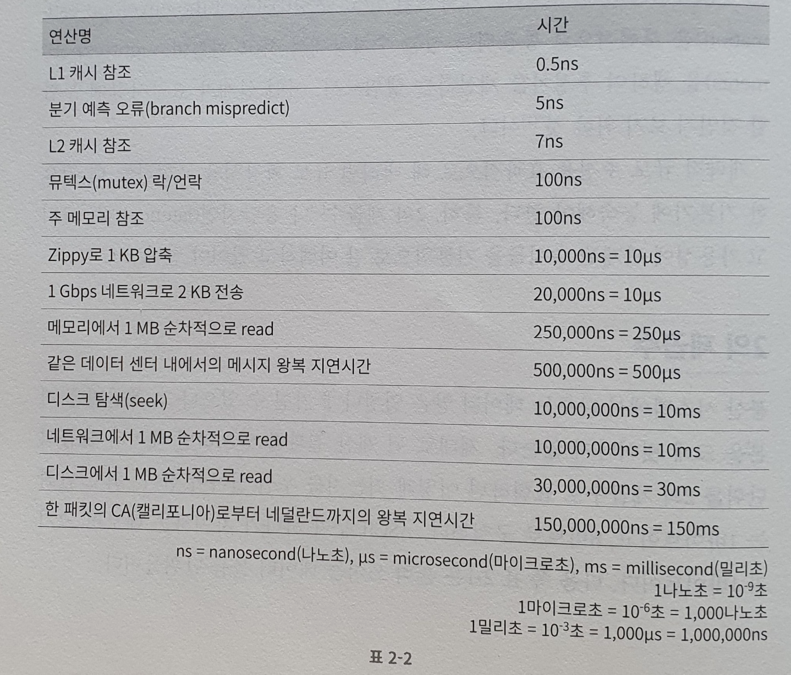

# 개략적인 규모 추정

개략적인 규모 추정?

:보편적으로 통용되는 성능 수치상에서 사고 실험을 행하여 추정치를 계산하는 행위

이를 잘하기 위해선 규모 확장성을 표현하는 데 필요한 기본기에 능숙해야한다.
특히 2의 제곱수나 응답지연 값, 그리고 가용성에 관계된 수치들을 기본적으로 잘 이해하고 있어야 한다.

## 2의 제곱수

분산 시스템에서 다루는 데이터 양은 엄청나게 커질 수 있지만, 그 계산법은 기본을 크게 벗어나지 않는다!
제대로 된 계산 결과를 얻으려면 
**데이터 볼륨의 단위를 2의 제곱수로 표현하면 어떻게 되는지를 우선 알아야 한다.** 
최소 단위는 1바이트(8비트)로 구성 : 아스키 문자 하나가 차지하는 메모리 크기 

## 모든 프로그래머가 알아야 하는 응답 지연값

> 왕복 지연시간을 보고 어디선가 봤던 재밌는 글이 떠올랐다.
> [500마일 이메일 문제](https://edykim.com/ko/post/500-mile-email-problem/)
> (500마일 이상 떨어진 곳엔 이메일이 발송되지 않는다는...)

이 수치를 기반으로 다음과 같은 결론을 낼 수 있다!

- 메모리는 빠르지만, 디스크는 아직도 느리다!
  - DB 디스크 IO를 피해야 하는 이유
- 디스크 탐색은 가능한 피하라
- 단순한 압축 알고리즘은 빠르다
- 데이터를 인터넷으로 전송하기 전에 가능하면 압축하라
- 데이터 센터는 보통 여러 지역에 분산되어 있고, 센터들 간 데이터를 주고 받는 데는 시간이 걸린다.
  - 1장에서 봤던 마스터 디비와 슬레이브 디비 반영시간이 어느 정도 걸리는 데 주요한 영향을 끼칠 수 있다.

## 가용성에 관계된 수치들

고가용성 : 시스템이 오랜시간동안 지속적으로 중단없이 운영될 수 있는 능력

- 가용성이 100% : 시스템이 단 한 번도 중단된 적이 없었음을 의미
  - 관용적으로 99%, 99.9999% 처럼 쓰는데, ~~9가 많으면 좋은거다~~

## 예제 : 트위터 QPS 와 저장소 요구량 측정

**가정**

- MAU 는 3억명
- 50%의 사용자는 매일 사용
- 평균 각 사용자는 매일 2건의 트윗을 올린다.
- 미디어를 포함하는 트윗은 10% 정도
- 데이터는 5년간 보관

**추정**

- QPS 추정치
  - DAU = 3억 * 50% = 1.5억
  - QPS = 1.5억 * 2트윗 / 24시간 / 3600초 = 약 3500
  - 최대 QPS = 약 7000

- 미디어 저장을 위한 저장소 요구량
  - 평균 트윗 크기
    - tweet_id 에 64바이트
    - 텍스트 140바이트
    - 미디어 1메가바이트
  - 미디어 저장소 요구량 : 1.5억 * 2 * 10% * 1MB = 30TB/일
- 5년간 미디어 보관을 위한 저장소 요구량 = 30TB * 365 * 5 = 55PB

> QPS : queries per second
>
> -> 여기선 생성 쿼리에 대한 QPS만 확인

## 팁

개략적 규모 추정을 위해서 QPS, 최대 QPS, 저장소 요구량, 캐시 요구량, 서버 수 등을 추정해보자!

