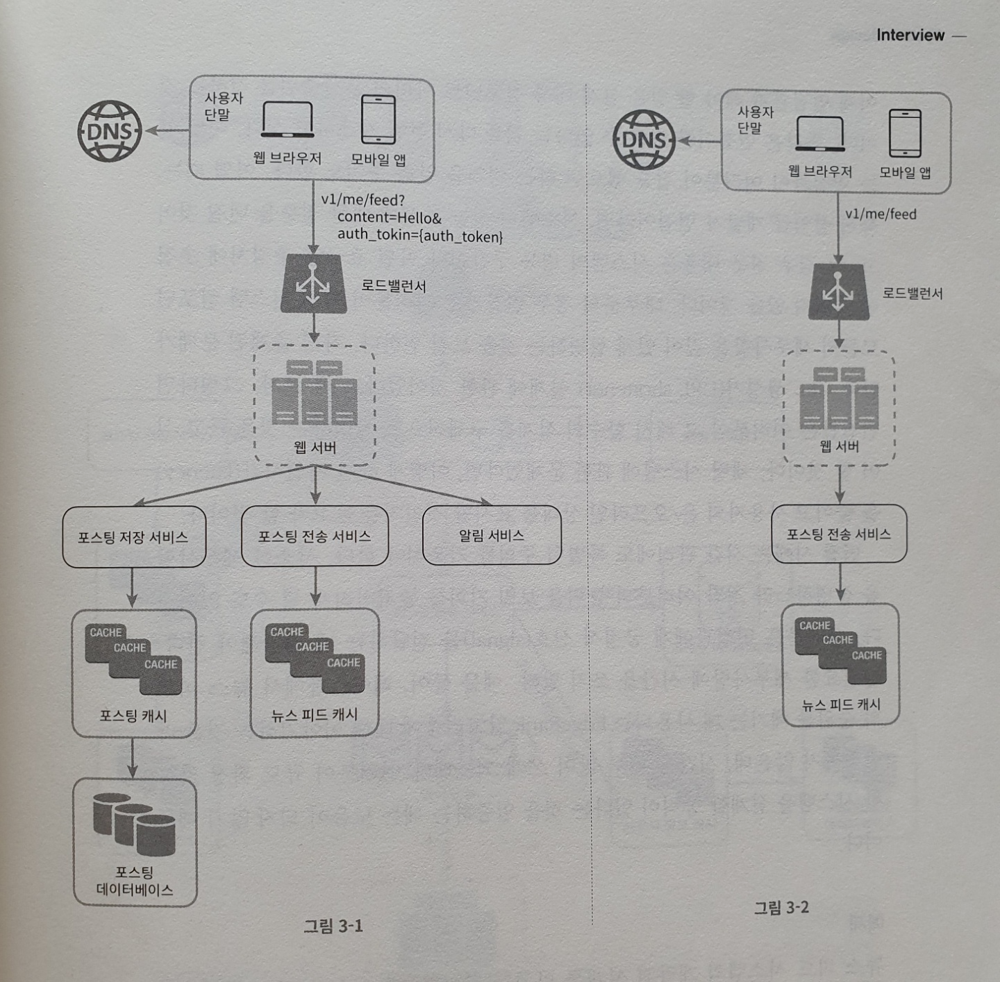
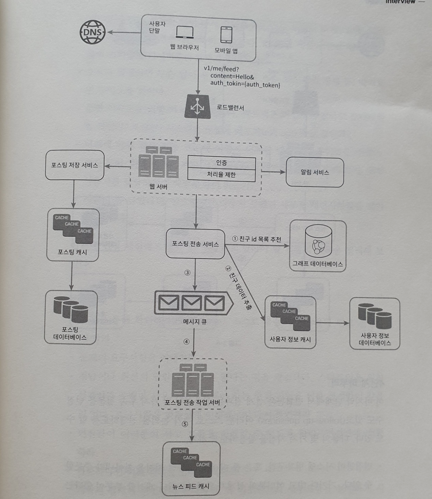
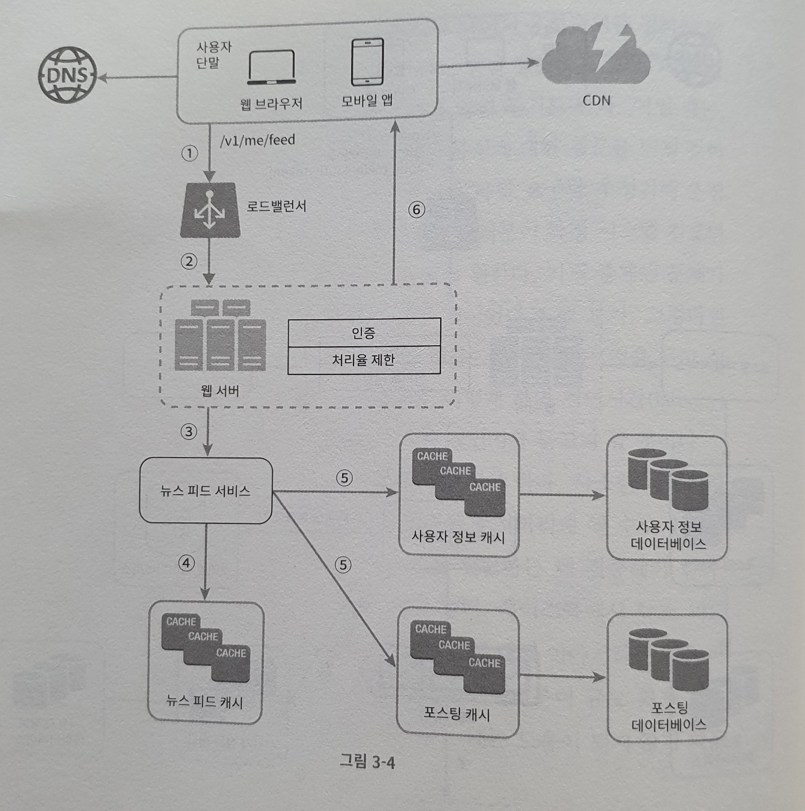

# 시스템 설계 면접 공략법

 

## 효과적 면접을 위한 4단계 접근법

정답은 없지만 모범적인 절차나 범위를 따라가보자.

### 1단계. 문제 이해 및 설계 범위 확정

깊이 생각하고 질문하여, 요구사항과 가정들을 분명히 하라!

올바른 질문을 통해서 적절한 가정, 시스템 구축에 필요한 정보를 모으는 행위를 하자.

- 구체적으로 어떤 기능을 만들어야?
- 제품 사용자 수는?
- 회사 규모의 성장 속도는?
- 기술 스택은? 설계를 단순화하기 위해 활용할 수 있는 기존 서비스는?

**예제**

뉴스 피드 시스템을 설계하라는 요구를 받았다면,

- 모바일 앱과 웹 앱 가운데 어느 쪽을 지원해야 하나요?
  - 둘 다 지원해야 합니다.
- 가장 중요한 기능은?
  - 새로운 포스트를 올리고 다른 친구의 뉴스 피드를 보는 기능
- 뉴스 피드는 시간 역순 정렬인가? 아니면 특별한 정렬 기준이 있는가?
  (가까운 친구의 포스트가 사용자 그룹에 올라가는 포스트보다 더 중요하다거나)
  - 단순화를 위해 시간 역순으로 정렬
- 최대 몇 명의 사용자와 친구를 맺을 수 있나?
  - 5천명
- 트래픽은?
  - DAU 1천만명
- 피드에 이미지나 비디오도 가능?
  - 미디어 파일도 가능!

### 2단계. 개략적인 설계안 제시 및 동의 구하기

- 설계안에 대한 최초 청사진을 제시하고 의견을 구하라!
  팀원인 것처럼 대하고 설계과정에 개입하여 같이 설계해도 좋다.

- 핵심 컴포넌트를 포함하는 다이어 그램을 그려라!

- 제약사항들을 만족하는지를 개략적으로 계산해보라. 
- API 엔드포인트나 DB 스키마도 설계해야하는지는 문제에 따라 다르다. (포커 게임의 백엔드를 설계하세요! 이러면 스키마까지 설계해야겠지?)

**예제**

뉴스 피드 설계 그대로, 피드 발행과 피드 생성 2가지 flow 로 나누어 생각해보자!

- 피드 발행
  - 사용자가 포스트를 올리면 관련된 데이터가 캐시/데이터베이스에 기록되고, 해당 사용자의 친구 뉴스 피드에 뜨게 된다.
- 피드 생성
  - 어떤 사용자의 뉴스 피드는 해당 사용자 친구들의 포스트를 시간 역순으로 정렬하여 만든다.

### 3단계. 상세 설계

여기까지 왔다면 아래의 목표는 달성했다.

- 전반 달성해야 할 목표와 기능 범위 확인
- 전체 설계의 개략적 청사진 마련
- 해당 청사진에 대한 면접관의 의견 청취
- 상세 설계에서 집중해야 할 영역들 확인

**예제**

11장에서 좀 더 자세히 설명할 것!

### 4단계. 마무리

- 시스템의 병목 구간, 혹은 더 개선 가능할 지점을 찾아보자
- 설계를 다시 한 번요약해도 좋다
- 오류가 생기면 어떤 일이 발생할지 따져보자
- 운영 이슈도 논의해보자
  - 메트릭 수집, 모니터링, 로그. 시스템 배포
- 미래의 규모 확장

