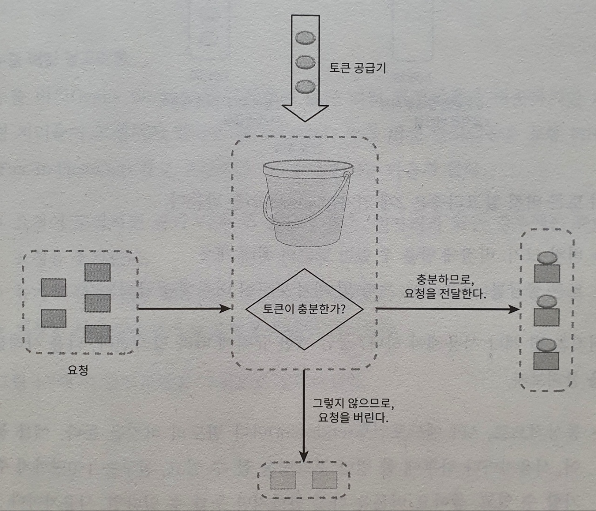
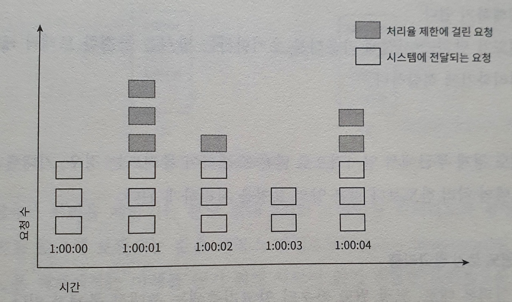
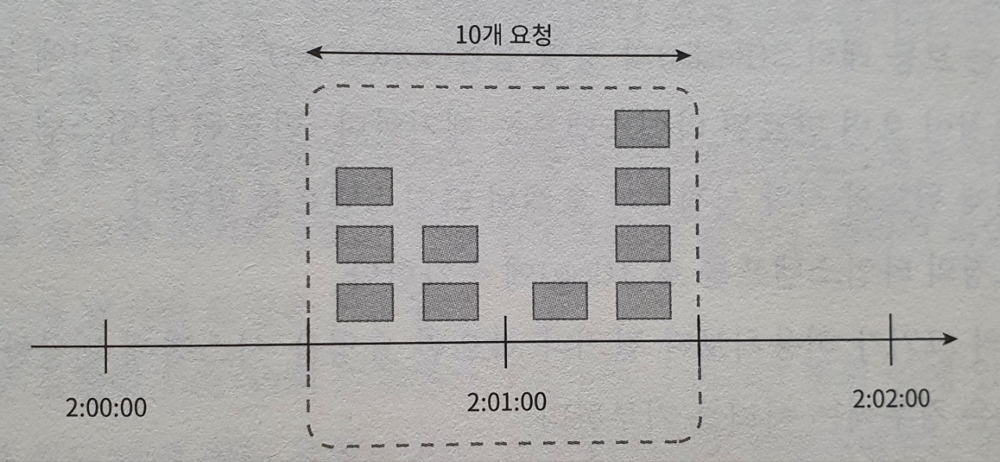
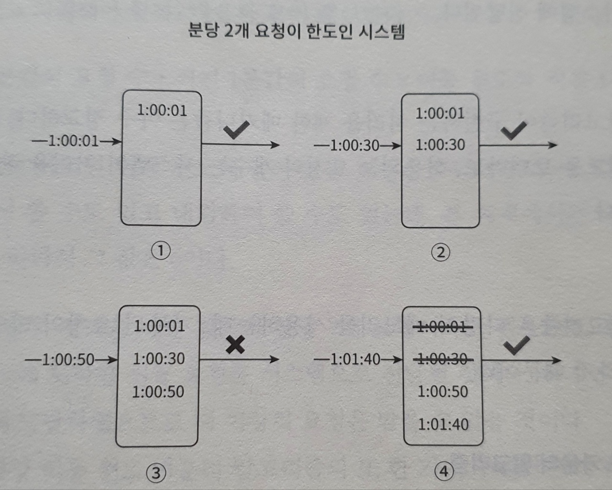
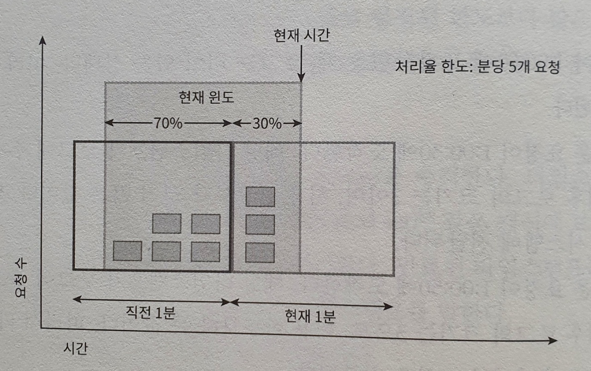
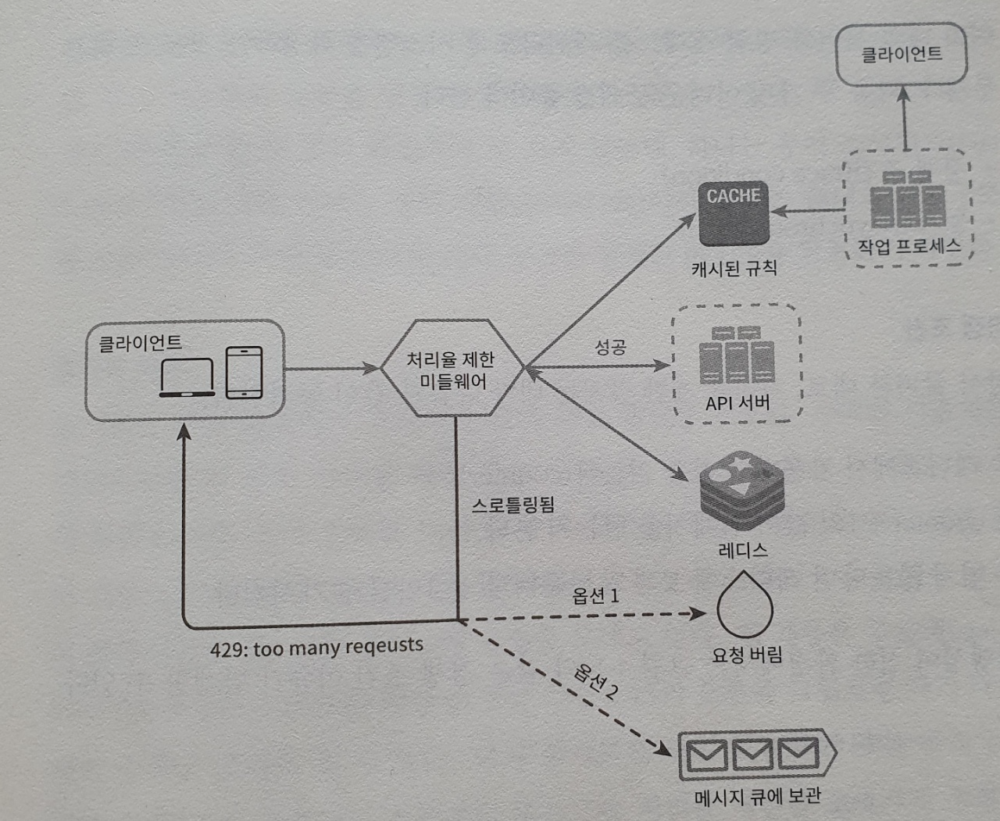

# 처리율 제한 장치의 설계

처리율 제한 장치 : 클라이언트 또는 서비스가 보내는 트래픽 처리율을 제어하기 위한 장치.

API 요청 횟수가 제한장치에 정의된 임계치를 넘어서면 추가로 도달한 호출은 중단된다!

- 사용자는 초당 2회이상 새 글을 올릴 수 없다
- 같은 IP주소로는 하루에 10개 이상 계정 생성할 수 없다
- 같은 디바이스로는 주당 5회 이상 리워드를 요청할 수 없다

와 같은 처리율을 제한한다고 생각해보자!

### 제한해서 좋은점은?

- Dos(Denial of Service) 공격에 의한 자원 고갈을 방지할 수 있다
- 비용 절감 -> 우선 순위 높은 API 에 자원 할당 가능
- 서버 과부하를 막는다

## 1단계 문제 이해 및 설계 범위 확정

처리율 제한을 위해 여러 가지 알고리즘을 선택할 수 있는데, 요구사항을 정확히 파악하자.

### 요구사항

- 설정된 처리율을 초과하는 요청은 정확히 제한한다
- 낮은 응답시간 - 응답시간에 영향을 줘선 안된다
- 가능한 적은 메모리를 써야한다
- 분산형 처리율 제한 : 하나의 처리율 제한 장치가 여러 서버나 프로세스에서 공유할 수 있어야 한다
- 예외 처리 : 요청이 제한되었을 때 사용자에게 보여줘야 한다
- 높은 결함 감내성 : 제한 장치에 장애가 생기더라도 전체 시스템에 영향을 줘선 안된다.

## 2단계 개략적 설계안 제시 및 동의 구하기

### 처리율 제한 장치를 어디에 둘 것인가

클라이언트에 두는 것은 별로! -> 서버에 두자!

- 처리율 제한 장치를 API 서버에 두자
- 미들웨어로 만들어서 API 서버에 가는 요청을 통제하자
  - http 429 로 보내 사용자에게 알린다.
  - 마이크로 서비스의 경우 api gateway에 구현한다

>  API Gateway : 이는 보통 처리율 제한, SSL 종단, 사용자 인증, IP 허용 목록 관리 등을 지원하는 완전 위탁관리형 서비스

### 처리율 제한 알고리즘

- 토큰 버킷 
- 누출 버킷
- 고정 윈도 카운터
- 이동 윈도 로그
- 이동 윈도 카운터

#### 토큰 버킷 알고리즘

- 토큰 버킷 : 지정된 용량을 갖는 컨테이너

  - 사전 설정된 용량의 토큰이 주기적으로 채워지며, 버킷이 가득차면 추가 공급된 토큰은 버려진다

- 각 요청은 처리될 때마다 하나의 토큰을 사용하며, 요청이 있을 때마다 토큰이 충분히 있는지 확인한다.

  

#### 동작 과정

토큰 버킷 알고리즘은 2개 인자를 받는다.

- 버킷 크기: 4 
- 토큰 공급률: 4 라고 가정해보자!

- API 엔드포인트마다 별도의 버킷을 두고 사용자마다 1일 1회의 포스팅, 친구는 150명까지 추가 가능이라면 사용자마다 3개의 버킷을 두어야 한다.
- IP주소별로 처리율 제한이 필요하다면 주소마다 버킷 할당
- 시스템의 처리율을 제한한다면 모든 요청이 하나의 버킷을 공유해야 한다

**장점**

- 구현이 쉬움
- 메모리 사용에서 효율적
- 짧은 시간에 집중되는 트래픽도 처리 가능

**단점**

- 버킷 크기와 토큰 공급률 두 인자를 적절히 튜닝이 어렵다.

#### 누출 버킷 알고리즘

버킷이 가득찼는지 확인하고, 가득찼다면 요청을 버린다. 가득차지 않았다면 큐에 넣고 고정속도로 처리한다.

- 버킷 크기 : 큐 사이즈와 같은 값
- 처리율 : 몇 개의 항목을 지정된 시간당 처리할 지 지정

**장점**

- 큐 크기가 제한되어 있어 메모리 사용량 측면에서 효율적
- 고정된 처리율로 안정된 출력 가능

**단점**

- 단 시간 많은 트래픽이 몰릴 때는 큐에 오래된 요청이 쌓이고, 제때 처리하지 못하면 최신 요청은 버려진다
- 두 인자 튜닝이 어렵다

#### 고정 윈도 카운터 알고리즘

- 타임라인을 고정된 간격의 윈도우로 나누고, 각 윈도우마다 카운터를 붙인다.
- 요청 접수될 때마다 카운터의 값은 1씩 증가한다
- 카운터의 값이 사전에 설정된 임계치에 도달하면 새로운 요청은 새 윈도우가 열릴 때까지 버려진다.

다만 이 알고리즘의 가장 큰 문제는 윈도우의 경계 부근에 순간적으로 많은 트래픽이 집중될 경우, 윈도에 할당되 양보다 더 많은 요청이 처리될 수 있다는 것!

위 그림은 분당 최대 5개의 요청만을 허용하는 시스템인데,
2:00:00 ~ 2:01:00 사이에 5개의 요청이 들어왔고, 
2:01:00 ~ 2:02:00 사이에 또 다섯 개의 요청이 들어왔다.
이 때 윈도우 위치를 조금 옮겨서 살펴보면 1분동안 10개의 요청을 처리하여 한도의 2배를 처리한 것이 된다....!

**장점**

- 메모리 효율이 좋음
- 이해하기 쉬움
- 윈도우가 닫히는 시점에 카운터를 초기화하는 방식은 특정 트래픽 패턴을 처리하기에 적합

**단점**

- 윈도우 경계 부근에서 일시적으로 많은 트래픽이 몰려드는 경우, **기대했던 시스템의 처리 한도보다 많은 양의 요청을 처리하게 된다.**

#### 이동 윈도우 로깅 알고리즘

고정 윈도우 카운터 알고리즘의 문제를 해결하기 위해 나온 알고리즘

- 요청의 타임스탬프를 추적
  - 레디스의 sorted set 같은 캐시에 보관
- 새 요청이 오면 만료된 타임스탬프는 제거, 만료된 타임스탬프는 그 값이 현재 윈도우 시작 시점보다 오래된 타임스탬프
- 새 요청의 타임스탬프를 로긍 ㅔ추가
- 로그의 크기가 허용치보다 같거나 작으면 요청을 시스템에 전달

분당 최대 2회의 요청을 처리하도록 설정

**장점**

- 허용되는 요청의 개수는 처리율 한도를 넘지 않는다

**단점**

- 메모리를 많이 사용 -> 거뷰된 요청의 타임스탬프도 기록하기 때문

#### 이동 윈도우 카운터 알고리즘

처리율 : 분당 7개 요청

- 현재 1분간의 요청 수 + 직전 1분간의 요청 수 * 이동 윈도우와 직전 1분이 겹치는 비율
  - 현재 윈도우에 들어있는 요청 = 3 + 5 * 70% = 6.5개

**장점** 

- 평균 처리율에 따라 현재 윈도우의 상태를 계산 -> 짧은 시간에 몰리는 트래픽에도 대응 가능
- 메모리 효율 좋음

**단점**

- 직전 시간대에 도착한 요청이 균등하게 분포되어있다고 가정하기에 다소 느슨한 개산
- 하지만 심각한 문제는 아님. 

### 개략적인 아키텍처

얼마나 많은 요청이 접수되었는지 추적하는 카운터를 추적 대상별로 두고 (유저별? IP 별? 엔드포인트별?)

카운토 보관하는 곳을 설계해야한다.

- DB는 디스크 접근이니 생략
- 메모리 상에서 동작하는 캐시가 바람직, 시간에 만료할 수 있어야하기에 redis 가 자주 쓰인다.

동작 원리 

- 클라가 처리율 제한 미들웨어에게 요청을 보낸다.
- 처리율 제한 미들웨어는 레디스의 지정 버킷에서 카운터를 가져와서 한도에 도달했는지 검사

- 한도에 도달하지 않았다면 API 서버로 전달되며 카운터의 값을 증가시킨 후 다시 레디스에 저장

## 3단계 상세 설계

- 처리율 제한 규칙은 어떻게 만들어지고, 어디에 저장되는가?
- 처리가 제한된 요청들은 어떻게 처리되는가?

### 처리율 한도 초과 트래픽의 처리

2가지 옵션

- 요청 버린다
- 메시지 큐에 보관

#### 처리율 제한 장치가 사용하는 HTTP 헤더

처리율 제한장치는 클라이언트에게

- X-Ratelimit-Remaining: 윈도우 내의 남은 처리 가능 요청 수
- X-Ratelimit-Limit: 매 윈도우마다 클라이언트가 전송할 수 있는 요청의 수
- X-Ratelimit-Retry-After: 한도 제한에 걸리지 않으려면 몇 초 뒤에 요청을 다시 보낼지 

### 상세 설계

- 처리율 제한 규칙은 디스크에 보관!
  - 작업 프로세스(workers)는 수시로 규칙을 디스크에서 읽어 캐시에 저장!
- 미들웨어는 제한 규칙을 캐시에서 가져오며, 카운터 및 마지막 요청의 타임스탬프를 레디스 캐시에서 가져온다.

#### 경쟁 조건

처리율 제한 장치는 다음과 같이 동작!

- 레디스에서 카운터의 값을 읽는다
- counter + 1 의 값이 임계치를 넘는지 확인
- 넘지 않는다면 레디스에 보관된 카운터 값을 1만큼 증가시킨다 (redis - incr)
  - 이를 해결하기 위해 루아 스크립트 혹은 정렬집합을 사용한다!

> INCR 연산도 경쟁조건 이슈가 없지만 값을 읽어올 때 생길 수도..??

#### 동기화 이슈

동기화는 분산 환경에서 고려해야한다!

- 고정 세션 -> 별로
- 레디스와 같은 중앙 집중형 데이터 저장소를 사용하자

#### 성능 최적화

- 데이터센터에서 멀리 떨어진 사용자를 지원하려다보면 지연시간이 길어진다.
- 따라서 edge server를 두자!
  - 사용자의 트래픽을 가까운 엣지 서버로 전달해 지연시간을 줄인다

#### 모니터링

- 모니터링을 통해 알고리즘이 효과적인지, 규칙이 효과적인지 확인해야 한다!

## 4단계 마무리

추가로 더 알면 좋을 것들

- 경성 처리율 제한 : 요청의 개수는 임계치를 넘을 수 없다
- 연성 처리율 제한 : 요청의 개수는 임계치를 잠시 넘을 수도 있다

- 다양한 계층에서 처리율 제한
  - IP는 3번 계층에 위치, 여기서 처리율 제한이 가능하다!