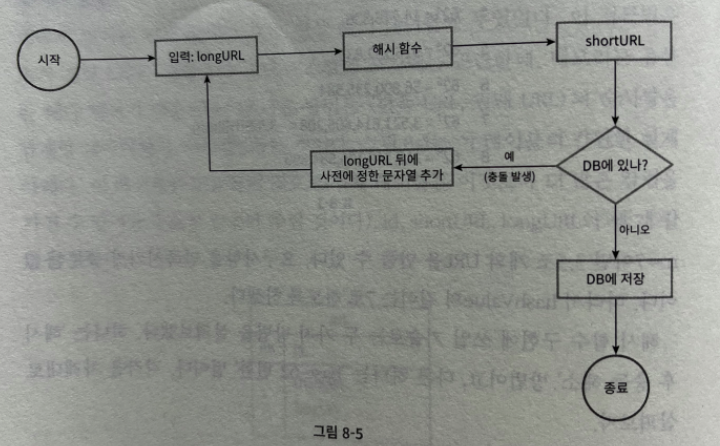
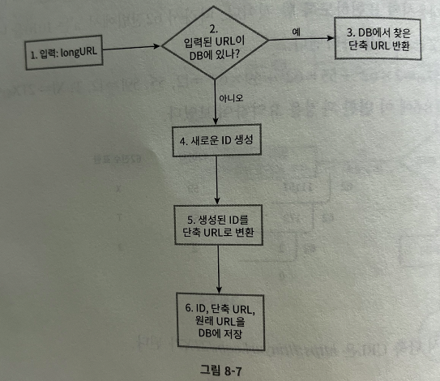

# URL 단축기 설계


## 1단계 문제 이해 및 설계 범위 확정

- URL 단축
- 축약된 url 로 요청이 오면 원래 url 로 안내
- 높은 가용성과 규모 확장성, 그리고 장애 감내


### 개략적 추정

- 쓰기 연산
  - 매일 1억개
  - 초당 쓰기 연산 : 1160
- 읽기연산
  - 쓰기 연산의 10배로 가정
- url 단축 서비스를 10년간 운영한다고 가정-> 3650억 개의 레코드 보관
- 축약 전 url 평균 길이는 100
  - 10년동안 필요한 저장 용량은 36.5TB (3650억 * 100바이트) 


## 2단계 개략적 설계안 제시 및 동의 구하기

API 엔드포인트, url 리디렉션, url 단축 플로우 확인

### API 엔드포인트

- 단축용 엔드포인트
- 리디렉션용 엔드포인트

### URL 리디렉션

단축 url 을 입력하면 서버는 url 을 원래 url 로 바꾸어서 
response 는 301 로 헤더에 location 으로 원래 url 을 넣어서 보내준다.

여기서 상태코드 301과 302를 비교해보자.

- 301 Permanently moved
  - 해당 url에 대한 http 요청이 처리 책임이 영구적으로 location 헤더에 반환된 url 로 이전되었다는 응답이다. 
  - 영구적으로 이전되었으믈 브라우저는 이 **응답을 캐시**한다.
  - 단축 서버 부하 줄이는 것이 좋다면 301 로 내려주면 좋다.
- 302 Found
  - 일시적으로 location 헤더가 지정하는 url 에 의해 처리외어야 한다는 응답.
  - 트래픽 분석이 중요할 때는 302를 내려줘서 클릭 발생률이나 발생 위치를 추적할 수 있다.

url 리디렉션을 구현하는 가장 직관적인 방법은 해시 테이블을 사용하는 것!

```originalUrl = hashTable.get(shortenUrl)```

### URL 단축

해시 함수는 다음 요구조건을 만족해야한다!

- 입력으로 주어지는 긴 url이 다른 값이면 해시 값도 달라야 한다.
- 계산된 해시 값은 원래 입력으로 주어졌던 긴 url 로 복원될 수 있어야한다.


## 3단계 상세 설계

### 데이터 모델

개략적 설계에서 해시테이블을 두고 사용했는데 메모리는 비싸기에.... 데이터베이스에 저장해두자.

테이블에는 `id, shortenUrl, longUrl` 이면 충분하다.

### 해시 함수

해시 함수는 원래 url을 단축 url 로 변환하는데에 사용

**해시 값 길이**

hashValue(단축된 값) 는 문자들로 이뤄지며, **요구사항의 조건을 만족하기 위해 3650억개 이상을 만들 수 있어야** 한다.

문자는 알파벳 대소문자 + 숫자를 더해 26 + 26 + 10 = 62개.

[62^n > 3650억]을 만족하는 n은 7!

해시 함수 구현에 쓰일 기술 2가지를 찾아보자.


#### 해시 후 충돌 해소

긴 url 을 줄이려면 잘 알려진 해시 함수를 사용하는 것이다. 
그런데 CRC32 같은 해시 함수가 계산한 가장 짧은 해시값의 길이조차도 7보다는 길다.

-> 첫 7글자만 사용! 충돌이 발생한다면?
충돌이 해소될 때까지 사전에 정한 문자열을 해시 값에 저장한다!



문제는 단축 url 을 생성할 때 계속 DB 에 질의를 보내야하므로 오버헤드가 크다. 

데이터베이스 대신 **블룸필터를 사용**하면 성능을 높일 수 있다.

>  블룸필터? : 어떤 집합에 특정 원소가 있는지 검사할 수 있도록 하는, 확률론에 기초한 공간 효율이 좋은 기술


#### base-62 변환

진법 변환은 URL 단축기를 구현할 때 흔히 사용되는 접근법 중 하나.

수의 표현 방식이 다른 두 시스템이 같은 수를 공유해야 하는 경우에 유용!

62진법을 사용하는 이유는 hashValue 문자 개수가 62개이기 때문!


**접근법 비교**

| 해시 후 충돌 해소                                            | base-62 변환                                                 |
| ------------------------------------------------------------ | ------------------------------------------------------------ |
| 단축 url 길이 고정                                           | 가변적                                                       |
| 유일성이 보장되는ID 생성기 불필요                            | 유일성이 보장되는ID 생성기 필요                              |
| 해시 충돌 -> 해소 전략 필요                                  | 해시 충돌 X                                                  |
| ID로부터 단축 URL 을 계산하는 방식이 아니기에, 다음에 쓸 URL을 알아낼 수 없다. | ID가 1씩 증가하는 값이라고 가정하면, <br /> 다음에 쓸 단축 URL 값이 무엇인지 쉽게 알아낼 수 있어 보안상 문제가 될 수 있다. |


### URL 단축기 상세 설계

URL 단축기는 시스템의 핵심 컴포넌트이므로, 
처리 흐름이 논리적으로 단순하고, 기능적으로 언제나 동작해야한다.




### URL 리디렉션 상세 설계

쓰기보다는 읽기를 더 자주하기에, <단축 URL, 상세 URL> 의 쌍을 캐시에 저장한다.


## 4단계 마무리

URL 단축기의 API, 데이터 모델, 해시 함수, URL 단축 및 리디렉션 절차를 설계해보았다.

이외에도 설계 시 고려해본다면,

- 처리율 제한 장치 : 엄청난 양의 URL 단축 요청이 밀려들 경우, 무력화될 수 있다는 잠재적 보안 결점이 있다.
  - 처리율 제한장치를 두면 ,IP 주소를 비롯한 필터링 규칙들을 이용해 요청을 걸러낼 수 있을 것이다. 
