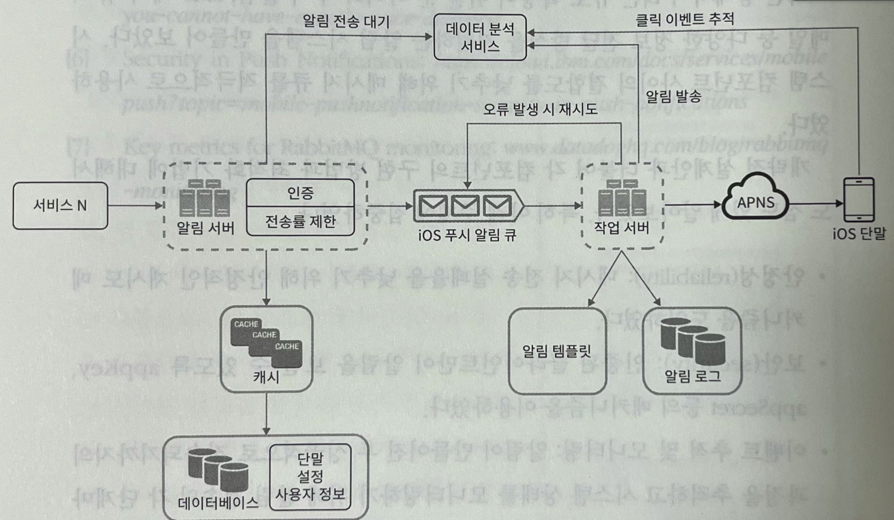

# 알림 시스템 설계

## 1단계. 문제 이해 및 설계 범위 확정

- soft한 실시간 시스템. 부하가 심할 경우 약간의 지연이 될 수 있다.
- 하루에 수백만건~천만겅의 알림을 보낼 수 있다.
- 기기는 ios, android, 데스크톱 등을 지원

## 2단계. 개략적 설계안 제시 및 동의 구하기

#### 알림 유형별 지원방안

- ios 푸시 알림
  - 알림 제공자 : 알림 요청을 만들어 APNS(애플 푸시 알림 서비스)로 보내는 주체
    - device token, payload 가 필요
  - APNS
    - 애플이 제공하는 원격 서비스
    - 푸시 알림을 iOS 장치로 보내는 역할 담당
  - iOS 기기

- 안드로이드
  - APNS 대신 FCM 활용
- SMS, 이메일은 생략하자. APNS, FCM 과 유사한 서비스로 구성이 동일하다고 추상화 가능

#### 연락처 정보 수집 절차

보내는 주체를 알아야 하니, 모바일 단말 토큰, 전화번호등의 정보를 DB에 저장

#### 알림 전송 및 수신 절차

여러 서비스에서 알림 시스템으로 API 등의 방식으로 알림 전송을 할 수 있고, 
알림 시스템은 제 3자 서비스에 전달할 알림 페이로드를 만들어낸다.
3자 서비스를 잘 추상화하여 확장성 있게 만들어야 한다. (ex. 중국에선 FCM을 쓸 수 없다.)

이렇게 알림 시스템이 하나로 있을 때 발생할 수 있는 문제점)

- SPOF
- 규모 확장성
  - 한대 서비스로 푸시 알림에 관계된 모든 것을 처리하므로, 
    DB나 캐시 등의 중요 컴포넌트 규모를 개별적으로 늘리기 어렵다.
- 성능 병목

개선한다면?

- DB 와 캐시를 알림 시스템의 주 서버에서 분리
- 알림 서버를 증설, 스케일 아웃 고려
- **메시지 큐를 이용해 컴포넌트 간 강결합을 끊는다**

### 3단계. 상세 설계

- 안정성
- 추가로 필요한 컴포넌트 및 고려사항
  - 알림 템플릿, 알림 설정, 전송률 제한, 재시도 메커니즘, 보안, 큐에 보관된 알림에 대한 모니터링, 이벤트 추적

#### 안정성

- 데이터 손실 방지
  - 알림 시스템은 알림 데이터를 DB에 보관하고 재시도 메커니즘을 갖고 있어야 한다.
- 알림 중복 방지
  - 완전히 막는 것은 불가능
  - 중복을 탐지하여 막아야 한다
    - 보내야 할 알림이 도착하면 그 이벤트 ID를 확인하는 방법을 사용

#### 추가로 필요한 컴포넌트 및 고려사항

- 알림 템플릿
- 알림설정
- 전송률 제한
- 재시도 방법
  - 재시도 전용 큐 활용
- 큐 모니터링
  - 큐에 쌓인 알림의 개수를 모니터링하여 작업 서버를 증설해야할 수도 있다
- 이벤트추적

